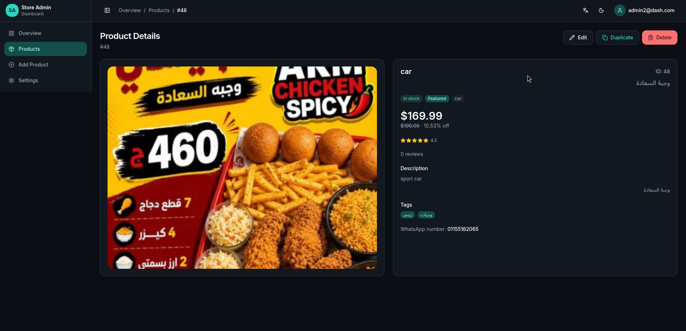

# 🍔 Food Store Admin Dashboard



A premium, high-performance Admin Dashboard built to manage products and operations for the Food Store E-commerce application. It provides a powerful interface for product management, secure authentication, and real-time analytics.

🔗 **Live Demo:** [https://dashboard-food-store.vercel.app/dashboard](https://dashboard-food-store.vercel.app/dashboard)

---

## ✨ Key Features

- **🔐 Secure Authentication**: Email and password-based admin login powered by Supabase Auth.
- **📦 Comprehensive Product Management (CRUD)**: Create, read, update, and delete products easily.
- **🖼️ Direct Image Uploads**: Seamlessly upload and manage product images directly to Supabase Storage.
- **📊 Analytics Overview**: Visual data representation using Recharts for quick business insights.
- **🌓 Dynamic Theming**: Full support for system, light, and dark mode themes.
- **🌍 Bilingual & RTL Support**: Fully localized in both **Arabic (Default, RTL)** and **English (LTR)**.
- **📱 Responsive & Fast**: Built with Vite and Tailwind CSS v4 for a blazing-fast, mobile-ready experience.

## 🛠️ Tech Stack

- **Frontend Framework**: [React 19](https://react.dev/) + [Vite](https://vitejs.dev/)
- **Language**: [TypeScript](https://www.typescriptlang.org/)
- **Styling**: [Tailwind CSS v4](https://tailwindcss.com/)
- **State Management**: [Zustand](https://github.com/pmndrs/zustand)
- **Forms & Validation**: [React Hook Form](https://react-hook-form.com/) + [Zod](https://zod.dev/)
- **Charts**: [Recharts](https://recharts.org/)
- **Routing**: [React Router](https://reactrouter.com/)
- **Localization**: [react-i18next](https://react.i18next.com/)
- **Database / Backend**: [Supabase](https://supabase.com/)

## 🚀 Getting Started

Follow these steps to set up the dashboard locally on your machine.

### Prerequisites
Make sure you have [Node.js](https://nodejs.org/) installed on your machine.

### Installation

1. **Clone the repository:**
   ```bash
   git clone https://github.com/1-COdeM-1/Dashboard-Food-Store.git
   cd Dashboard-Food-Store
   ```

2. **Install dependencies:**
   ```bash
   npm install
   ```

3. **Set up Environment Variables:**
   Rename `.env.example` to `.env` in the root directory and add your Supabase credentials:
   ```env
   VITE_SUPABASE_URL=your_supabase_url
   VITE_SUPABASE_ANON_KEY=your_supabase_anon_key
   ```

4. **Storage Bucket Configuration:**
   Ensure you have a Supabase Storage bucket named `products IMAGES`. If image uploads fail due to Row Level Security (RLS), run the SQL commands found in `supabase/storage-policies.sql` inside your Supabase SQL Editor.

5. **Start the development server:**
   ```bash
   npm run dev
   ```
   Open [http://localhost:5173](http://localhost:5173) in your browser to view the application.

## 📁 Project Structure

```text
src/
├── app/              # Core app configuration and routing
├── components/       # Reusable UI components (buttons, cards, modals, layout)
├── features/         # Feature-based modules (auth, products, theme, toast)
├── i18n/             # Localization configuration and translation files (ar, en)
├── lib/              # Utility libraries (Supabase client, schemas, helpers)
├── pages/            # Main application pages (Dashboard, Products, Login, etc.)
└── types/            # TypeScript type definitions
```

## 🚢 Deployment

This project is configured for seamless deployment on **Vercel**. 
It includes a `vercel.json` file which handles Single Page Application (SPA) routing to prevent 404 errors on refresh.

To deploy your own instance:
1. Push your code to GitHub.
2. Import the repository into Vercel.
3. Configure the `VITE_SUPABASE_URL` and `VITE_SUPABASE_ANON_KEY` in Vercel's Environment Variables settings.
4. Deploy!
